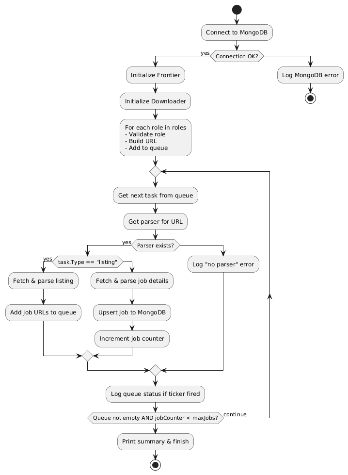
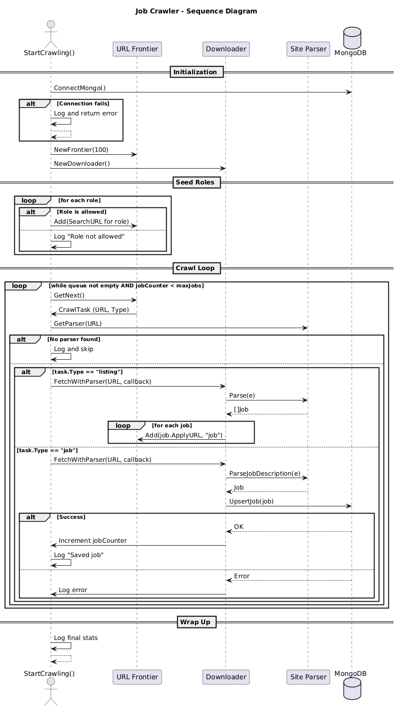
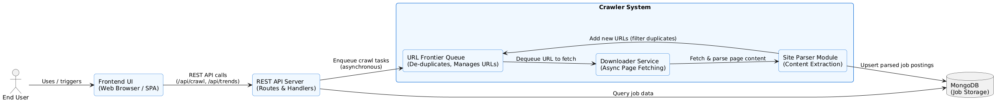

# Job Market Trend Analyzer
A scalable, backend-first system that scrapes real job listings, analyzes hiring trends, and serves insights through a fast API and a clean frontend. Built in Go, without unnecessary dependencies.

## What It Does
* Scrapes job data from [We Work Remotely](https://weworkremotely.com)
* Analyzes trends across:
  * Most in-demand skills
  * Frequently mentioned locations
  * Hiring companies
  * Experience level distribution
* Deduplicates and stores listings in MongoDB
* Cleans up stale listings automatically (TTL)
* Offers a minimal frontend to trigger crawls and view trends
* Background crawling with async updates — no page reloads

## Why I Built It
I wanted to understand how hiring patterns shift across roles — and use that as an excuse to build something real.
This wasn’t about making another CRUD app. I wanted concurrency, background processing, crawling architecture, and live data flowing through a pipeline I built end-to-end.

## Tech Stack

| Component   | Tool                        |
| ----------- | --------------------------- |
| Language    | Go (1.22)                   |
| Scraper     | Colly                       |
| Database    | MongoDB (Atlas)             |
| Trend Logic | Mongo Aggregation Pipelines |
| API Server  | `net/http`                  |
| Frontend    | Vanilla JS + HTML/CSS       |
| Infra       | Go Modules, `.env` config   |

## Architecture & Diagrams

### Internal Flowchart – `crawler.go`



### Sequence Diagram



- `/api/crawl?role=X` triggers `StartCrawling` in background
- `StartCrawling` spawns async workers for downloading jobs
- Deduplicated results are written to MongoDB


### High-Level Architecture
This is a clutter-free view of how components are organized logically and physically:



- **Frontend:** Basic HTML/CSS/JS served via Go’s static file server
- **API Server:** Uses `net/http` with role validation and background job handling
- **Job Crawler:** Modular, Colly-based crawlers per role
- **Trend Worker:** Aggregates skill/location trends using Mongo pipelines
- **MongoDB Atlas:** Stores job documents with TTL index

Each part is modular, extensible, and communicates clearly with its neighbors.


### Folder Structure
```
Job-Crawler
├── api_server           # API server and static frontend
│   ├── handlers         # API endpoint logic
│   ├── routes           # HTTP route mapping
│   ├── static           # Frontend JS + CSS
│   └── templates        # HTML views
├── internal             # Core crawling logic
│   ├── crawler          # Job scrapers and role logic
│   │   └── sites        # Site-specific parsers
│   ├── downloader       # HTTP client with timeout/cancel
│   └── urlfrontier      # Deduplicated job queue
├── pkg                  # MongoDB, models, shared utils
├── trend_worker         # Aggregation logic for trends
├── images               # Diagrams and screenshots
```


### API Endpoints

```http
GET /api/crawl?role=backend&role=ml
  → Starts background crawl for given roles

GET /api/trends?role=frontend
  → Returns trend report for a role
```

Crawls run in the background. The UI automatically refreshes results once done.

## How to Run

### Prerequisites

* Go 1.22+
* MongoDB Atlas URI

Create a `.env` file:

```
DATABASE_URL=mongodb+srv://<your-connection-string>
```

### Start the server:

```bash
go run api_server/main.go
```

Then open [http://localhost:8080](http://localhost:8080) in your browser.


## UI Preview


* Select a role (e.g., “Backend Developer”)
* Click “Analyze Now”
* A countdown shows scraping progress
* Trends appear when ready — no reloads


## Highlights

* Clean separation between crawling, storage, and analytics
* MongoDB TTL cleans up stale job listings after 30 days
* Background workers use context for timeout + cancellation
* Role validation to prevent junk API calls
* Trend analytics are fast, computed via aggregation pipelines
* No frontend framework — just async JS and minimal UI


## What I Learned

* Designing resilient crawlers with proper error handling
* Handling concurrency and graceful cancellation in Go
* Coordinating async jobs with the frontend
* Working with MongoDB's aggregation framework and TTL indexes
* Building something that actually solves a problem


## Author

**Achal** — backend-leaning engineer with an interest in systems that scale and data that tells a story.

GitHub: [@vx6fid](https://github.com/vx6fid)
X/Twitter: [@vx6fid](https://x.com/vx6fid)
